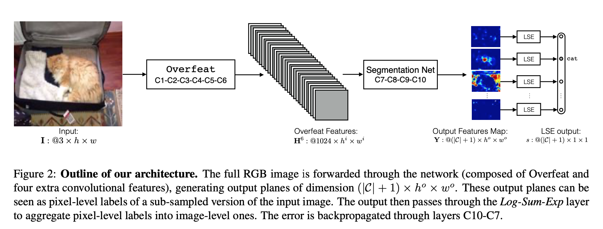
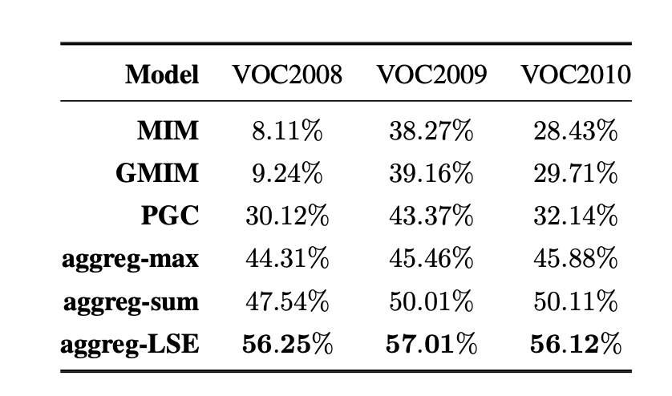

# 论文阅读笔记：From Image-level to Pixel-level Labeling with Convolutional Networks

## Introduce
### Task
Weakly supervised learning for image semantic segmentation, only use image class label.

### Contribution
* Combine MIL(Multiple Instance Learning) with classification CNN
* experiments is state of the art

## Framework
### Train

For input image $I:3\times h \times w$, pass a backbone(i.e. Overfeat + Segmentation Net), output feature maps $Y:(|C|+1) \times h^{o} \times  w^{o}$, then $Y$ pass a **LSE**(Log-Sum-Exp) pooling, output $s:(|C|+1) \times 1 \times  1$. Finally compute a softmax cross entrophy loss for $s$, backpropagation gradients to train backbone.

### Inference

$p_{i,j}(k)$ be the $Y$ for location $(i,j)$ and $k^{th}$ class label. ILP $p(k)$ be the $s$ by softmax.

$$\widehat{y}_{i,j}=p_{i,j}(k|I) \times p(k|I)$$

Finally, $\widehat{y}_{i,j}$ pass a interpolation to restore input image resolution. Then use a threshold(Smoothing Prior) to get the final segmentation results.

## Log-Sum-Exp(LSE)
$$s^k = \frac{1}{r}\log \left[ \frac{1}{h^o w^o} \sum\limits_{i.j} exp\left( r s_{i,j}^k \right)\right]$$
LSE is a pooling method for $Y:(|C|+1) \times h^{o} \times  w^{o}$ to $s:(|C|+1) \times 1 \times  1$, it is more smooth. When $s$ is high LSE similar to max pooling, $r$ low LSE similar to average pooling.

For accuracy, performance be more high compare to max pooling and sum pooling.

## Summary
* LSE is smooth pooling than max and average pooling. Maybe it is useful. 